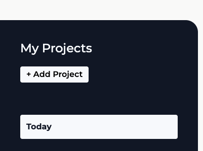
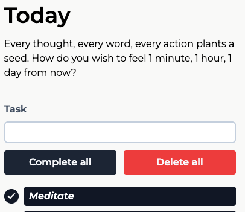
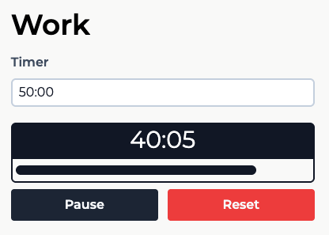

# 🧠 XP Flow

A gamified project and task management tool designed for productivity and motivation.

This app lets you manage projects and tasks like any standard to-do app, but with a twist: **audio feedback from games like Dota 2 and GTA: San Andreas keeps you engaged and entertained.**

## 🎮 Unique Features

### ✅ Gamified Task Completion
- Completing a task triggers **iconic Dota 2 kill streak sounds** based on how many tasks you've checked off:
  - *First Blood*, *Double Kill*, *Triple Kill*, etc.
- Sounds rotate based on the completion streak, making task-checking genuinely satisfying.

### ⏲️ Motivational Timer System
- Comes with two preset timers:
  - **Work** timer (default: 50 minutes)
  - **Break** timer (default: 10 minutes)
- When the timer ends, it plays the **"Mission Passed"** sound from **GTA: San Andreas**.
- Supports Start, Pause/Resume, and Reset.

## 🗂️ Features Overview

### 📁 Project Management
- Create, edit, and delete projects.
- Each project has:
  - `Name`
  - `Description`
  - `Due date`
  - `Task list`
- Project state is saved in `localStorage` and restored on reload.

### ✅ Task Management
- Add, edit, and delete individual tasks within a project.
- Tasks can be marked as complete/incomplete with one click.
- Inline editing with auto-focus behavior.

### ⏱️ Timer
- Highly customizable.
- Accepts `hh:mm:ss` format as input.
- Input validation prevents malformed timers.
- Keeps track of time accurately with `useRef` and `useState`.
- Progress is shown via a dynamic progress bar.

## 🔊 Soundpack Integration

- All sounds are played using a custom `AudioContext` and a `useAudio()` hook.
- Sound triggers include:
  - `SOUNDPACK.timerFinished` → GTA: San Andreas “Mission Passed”
  - `SOUNDPACK.soundEffect1`, `soundEffect2`, etc. → Dota 2 kill streaks
- Sounds can be easily extended by adding new files to the `SOUNDPACK`.

## 🧠 Tech Stack

- **React**: Core UI framework
- **React Hooks**: For state management (`useState`, `useEffect`, `useRef`)
- **Custom Hooks**: `useAudio`, `useProjects`, `useTodos`
- **Tailwind CSS**: Utility-first styling
- **UUID**: Used for generating unique element IDs
- **LocalStorage**: To persist selected project
- **Audio API**: For dynamic sound effects

## 📸 Preview
### Sidebar


### Project


### Timer


## 🚀 Future Enhancements

- [X] Add deadline visual indicators
- [X] Drag & drop for projects and todos to re-arrange them
- [X] Common deadline options (1 day, 1 week, 1 month)
- [X] Other soundpacks sounds (Mission Impossible)

## 🛠️ Setup Instructions
```
npm install
```
```
npm run dev
```

## 💬 Feedback & Contribution

Got sound suggestions or features you’d like to see? Open an issue or start a discussion!

## 🎧 Credits

- Dota 2 sound effects — © Valve
- GTA: San Andreas "Mission Passed" sound — © Rockstar Games

## License

MIT
